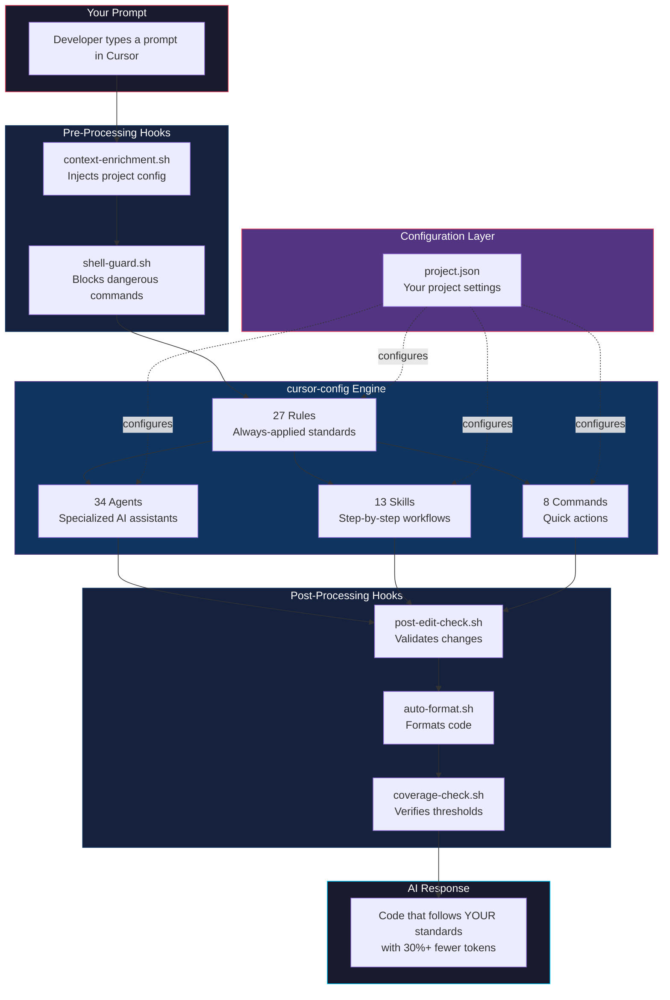
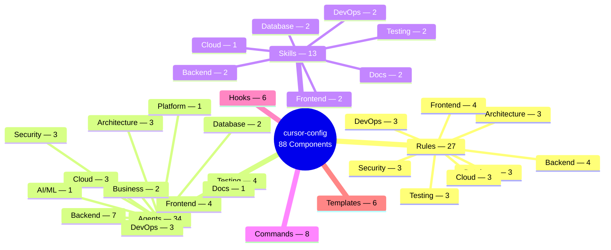
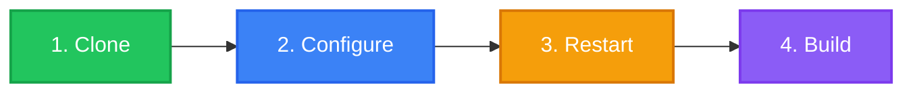
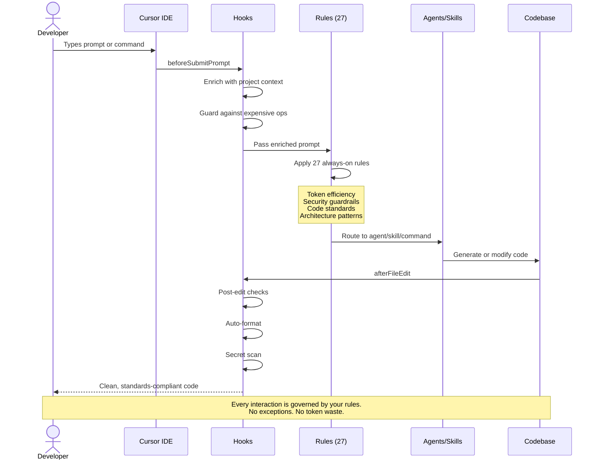
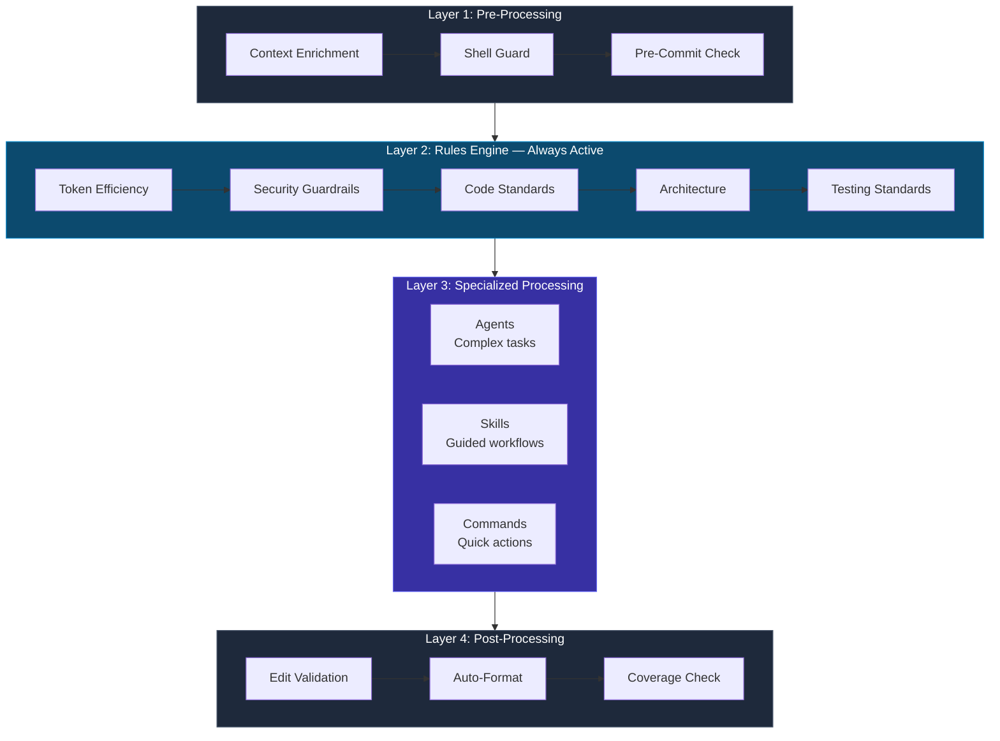
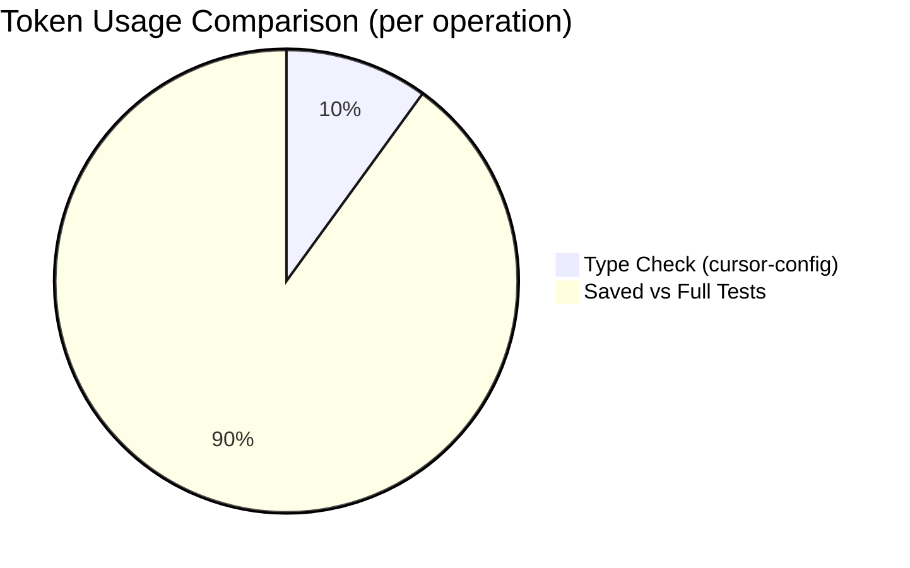
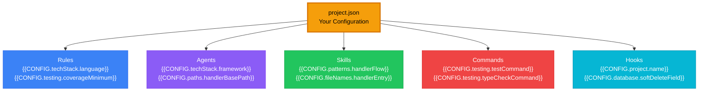
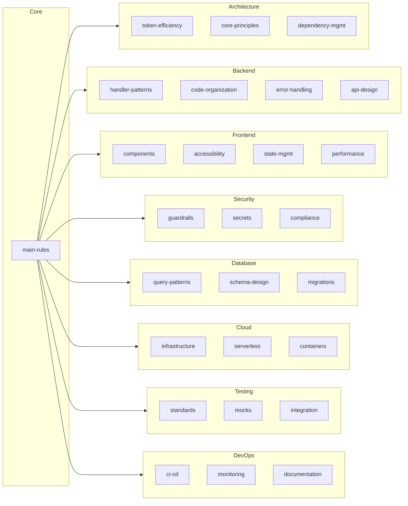
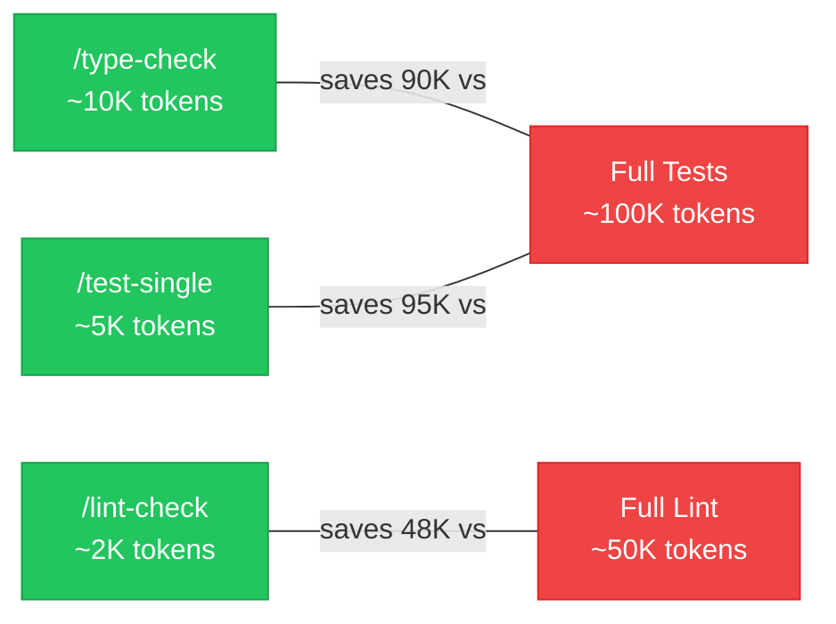
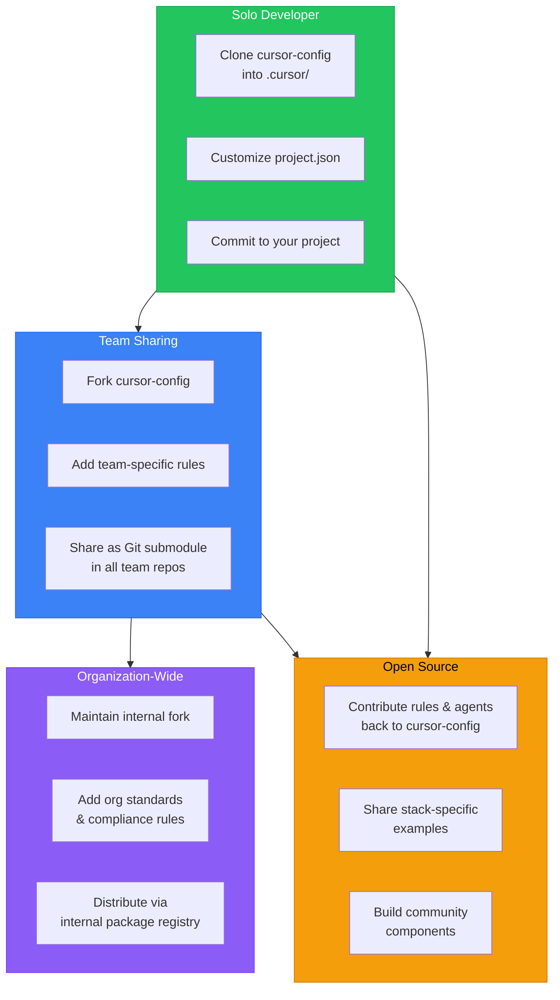

<p align="center">
  
  
  
  
</p>

# cursor-config

**The open-source Cursor IDE configuration boilerplate that turns your AI assistant into a senior engineer who follows your rules, knows your codebase, and never wastes a token.**

> Stop teaching your AI the same things every session. cursor-config gives Cursor permanent memory of your standards, security policies, and workflows — across every project, every team member, every prompt.

---

## The Problem

Every time you open Cursor IDE, your AI assistant starts from zero. It doesn't know your:

- Code conventions and architecture patterns
- Security policies (and happily hardcodes your API keys)
- Testing thresholds (and runs the full 100K-token test suite when you just wanted a type check)
- Handler patterns, naming conventions, or folder structure

You end up repeating yourself, burning tokens, and fixing the same mistakes. **cursor-config fixes this permanently.**

---

## How It Works



---

## What's Inside



| Layer         | Count | What It Does                                      | How It's Triggered                  |
| ------------- | ----: | ------------------------------------------------- | ----------------------------------- |
| **Rules**     |    27 | Enforces coding standards on every AI interaction | Automatically — always on           |
| **Agents**    |    34 | Specialized assistants for complex tasks          | On demand — `/agent-name`           |
| **Skills**    |    13 | Step-by-step guided workflows with checklists     | Contextually — when patterns match  |
| **Commands**  |     8 | Lightweight, token-efficient quick actions        | On demand — `/command`              |
| **Hooks**     |     6 | Automation scripts in the AI loop                 | Event-driven — before/after actions |
| **Templates** |     6 | Scaffolding for handlers, components, tests, etc. | Referenced by skills and agents     |

---

## Quick Start (5 minutes)



### Step 1 — Clone

```bash
# Into your existing project
git clone https://github.com/girijashankarj/cursor-config.git .cursor
```

### Step 2 — Configure

```bash
cp .cursor/config/project.json.template .cursor/config/project.json
```

Edit `.cursor/config/project.json` — replace placeholders with your project details:

```json
{
	"project": { "name": "my-api", "description": "Order management service" },
	"techStack": {
		"language": "TypeScript",
		"framework": "Express.js",
		"database": "PostgreSQL",
		"testing": "Jest",
		"packageManager": "pnpm"
	},
	"testing": {
		"coverageMinimum": 90,
		"testCommand": "pnpm run test",
		"typeCheckCommand": "pnpm run type-check"
	}
}
```

### Step 3 — Restart Cursor IDE

Close and reopen Cursor. All 88 components are now active.

### Step 4 — Verify

Try any of these:

```
/type-check          → Runs type checking (saves ~90K tokens vs full tests)
/code-reviewer       → AI reviews your code like a senior engineer
/generate-handler    → Scaffolds a complete API handler
```

### Alternative: One-Line Setup

```bash
curl -fsSL https://raw.githubusercontent.com/girijashankarj/cursor-config/main/scripts/setup-cursor.sh | bash
```

### Alternative: Git Submodule (for teams)

```bash
git submodule add https://github.com/girijashankarj/cursor-config.git .cursor
cp .cursor/config/project.json.template .cursor/config/project.json
```

---

## User Flow

Here's what happens at every stage of your development workflow:



### Typical Workflows

| What You Want        | What You Type                    | What Happens                                                   |
| -------------------- | -------------------------------- | -------------------------------------------------------------- |
| Build a new endpoint | "Create a POST /orders endpoint" | Skill triggers full handler scaffolding (9 files, 7-step flow) |
| Review code          | `/code-reviewer`                 | Agent checks security, performance, correctness, tests         |
| Fix broken tests     | `/testing-agent fix these tests` | Skill diagnoses failures, fixes mocks, verifies coverage       |
| Quick validation     | `/type-check`                    | Runs type check (~10K tokens) instead of full tests (~100K)    |
| Deploy safely        | `/deployment-agent`              | Agent generates deployment checklist with rollback plan        |
| Optimize a query     | `/query-opt-agent`               | Agent runs EXPLAIN ANALYZE, rewrites query, adds indexes       |

---

## Processing Pipeline

Every prompt flows through a layered processing pipeline that ensures quality, security, and efficiency:



### Layer Breakdown

**Layer 1 — Pre-Processing (Hooks)**
Before your prompt even reaches the AI, hooks inject your project context, block dangerous shell commands, and validate git operations.

**Layer 2 — Rules Engine (27 Rules, Always Active)**
Every AI response is shaped by your rules. These aren't suggestions — they're hard constraints:

| Rule Category     | What It Enforces                                            |
| ----------------- | ----------------------------------------------------------- |
| Token Efficiency  | No auto-running full tests/lint; confirm 50K+ ops           |
| Security          | No hardcoded secrets; no PII in logs; parameterized queries |
| Architecture      | Handler pattern; dependency direction; error hierarchy      |
| Code Organization | Naming conventions; import order; folder structure          |
| Database          | Soft delete only; required columns; migration safety        |
| Testing           | 90%+ coverage; mock patterns; AAA pattern                   |

**Layer 3 — Specialized Processing**
Based on your prompt, the right component activates: an agent for complex tasks, a skill for guided workflows, or a command for quick operations.

**Layer 4 — Post-Processing (Hooks)**
After code is generated, hooks validate the output, auto-format files, scan for leaked secrets, and verify test coverage.

---

## Token Savings

cursor-config is engineered to cut your AI token costs by 30% or more:



| Without cursor-config           | With cursor-config                     | Tokens Saved   |
| ------------------------------- | -------------------------------------- | -------------- |
| Full test suite: ~100K tokens   | `/type-check`: ~10K tokens             | **~90K (90%)** |
| Full lint run: ~50K tokens      | `/lint-check` (read_lints): ~2K tokens | **~48K (96%)** |
| Full test suite: ~100K tokens   | `/test-single`: ~5K tokens             | **~95K (95%)** |
| Unfiltered context: ~30K tokens | Context layering: ~10K tokens          | **~20K (67%)** |
| Verbose AI output: ~15K tokens  | Concise guidelines: ~5K tokens         | **~10K (67%)** |

**Conservative estimate**: A developer making 50 AI interactions/day saves **~200K tokens/day** — that's real money at scale.

---

## Customization

cursor-config is 100% configuration-driven. Every component adapts to your project through a single file:

### Configuration Architecture



### What You Can Customize

| Section       | What It Controls           | Example                                        |
| ------------- | -------------------------- | ---------------------------------------------- |
| `project`     | Project identity           | Name, description, repo URL                    |
| `techStack`   | Language, framework, tools | TypeScript + Express or Python + FastAPI       |
| `paths`       | Directory structure        | Where handlers, services, and common code live |
| `domain`      | Business entities          | Order, Product, Customer + lifecycle states    |
| `patterns`    | Code patterns              | 7-step handler flow, error handling strategy   |
| `testing`     | Quality gates              | 90% coverage, test/lint/type-check commands    |
| `database`    | DB conventions             | Soft delete field, timestamp columns, naming   |
| `packages`    | Internal packages          | `@your-org` scope, registry URL                |
| `conventions` | Git and workflow           | Branch prefixes, commit format, PR templates   |

### Ready-Made Stack Configs

Don't start from scratch — pick your stack:

| Stack              | File                                                           | Language   | Framework   |
| ------------------ | -------------------------------------------------------------- | ---------- | ----------- |
| TypeScript/Express | [`examples/typescript-express/`](examples/typescript-express/) | TypeScript | Express.js  |
| TypeScript/NestJS  | [`examples/typescript-nest/`](examples/typescript-nest/)       | TypeScript | NestJS      |
| Python/FastAPI     | [`examples/python-fastapi/`](examples/python-fastapi/)         | Python     | FastAPI     |
| Go/Chi             | [`examples/go-chi/`](examples/go-chi/)                         | Go         | Chi         |
| React SPA          | [`examples/react/`](examples/react/)                           | TypeScript | React       |
| Next.js            | [`examples/nextjs/`](examples/nextjs/)                         | TypeScript | Next.js     |
| Rust/Actix         | [`examples/rust-actix/`](examples/rust-actix/)                 | Rust       | Actix Web   |
| Kotlin/Spring      | [`examples/kotlin-spring/`](examples/kotlin-spring/)           | Kotlin     | Spring Boot |
| Flutter            | [`examples/flutter/`](examples/flutter/)                       | Dart       | Flutter     |

```bash
# Use a pre-made config
cp examples/typescript-express/project.json .cursor/config/project.json
# Then customize with your project specifics
```

---

## Component Deep Dive

### Rules (27) — Your AI's Permanent Memory

Rules are the backbone. They load on every interaction, every time, with zero effort.



### Agents (34) — Your On-Demand Specialists

| Domain           | Agent                | Invocation              | Best For                          |
| ---------------- | -------------------- | ----------------------- | --------------------------------- |
| **Architecture** | Design Agent         | `/design-agent`         | System design, trade-off analysis |
|                  | Refactoring Agent    | `/refactoring-agent`    | Safe incremental refactoring      |
|                  | Migration Agent      | `/migration-agent`      | Framework upgrades, migrations    |
| **Backend**      | Code Reviewer        | `/code-reviewer`        | PR reviews, security checks       |
|                  | Implementation Agent | `/implementation-agent` | Building features end-to-end      |
|                  | Debugging Agent      | `/debugging-agent`      | Root cause analysis               |
|                  | API Agent            | `/api-agent`            | REST API design                   |
|                  | Performance Agent    | `/performance-agent`    | Bottleneck identification         |
|                  | Database Agent       | `/database-agent`       | Schema design, queries            |
|                  | Event Handler Agent  | `/event-handler-agent`  | Async event processing            |
| **Frontend**     | UI Component Agent   | `/ui-component-agent`   | Accessible components             |
|                  | State Agent          | `/state-agent`          | State management decisions        |
|                  | Styling Agent        | `/styling-agent`        | CSS architecture, theming         |
|                  | Frontend Perf Agent  | `/frontend-perf-agent`  | Core Web Vitals optimization      |
| **Testing**      | Testing Agent        | `/testing-agent`        | Write comprehensive tests         |
|                  | E2E Agent            | `/e2e-agent`            | End-to-end test flows             |
|                  | Load Test Agent      | `/load-test-agent`      | Performance benchmarking          |
|                  | Security Test Agent  | `/security-test-agent`  | Vulnerability scanning            |
| **Database**     | Schema Agent         | `/schema-agent`         | Schema design, ER diagrams        |
|                  | Query Opt Agent      | `/query-opt-agent`      | Query performance tuning          |
| **Security**     | Security Audit Agent | `/security-audit-agent` | Comprehensive security audit      |
|                  | Auth Agent           | `/auth-agent`           | Auth flows, RBAC                  |
|                  | Compliance Agent     | `/compliance-agent`     | GDPR, SOC 2, HIPAA                |
| **Cloud**        | Infra Agent          | `/infra-agent`          | IaC, cloud architecture           |
|                  | Deployment Agent     | `/deployment-agent`     | Zero-downtime deployments         |
|                  | Cost Agent           | `/cost-agent`           | Cloud cost optimization           |
| **DevOps**       | CI/CD Agent          | `/ci-cd-agent`          | Pipeline design                   |
|                  | Monitoring Agent     | `/monitoring-agent`     | Observability setup               |
|                  | Incident Agent       | `/incident-agent`       | Incident response                 |
| **Business**     | Requirements Agent   | `/requirements-agent`   | User stories, specs               |
|                  | Estimation Agent     | `/estimation-agent`     | Effort estimation                 |
| **AI/ML**        | Prompt Agent         | `/prompt-agent`         | Prompt engineering                |
| **Docs**         | Docs Agent           | `/docs-agent`           | Technical documentation           |
| **Platform**     | DX Agent             | `/dx-agent`             | Developer experience              |

### Commands (8) — Token-Efficient Quick Actions



| Command             | What It Does               | Why It's Better                   |
| ------------------- | -------------------------- | --------------------------------- |
| `/type-check`       | TypeScript type validation | 10K tokens vs 100K for full tests |
| `/test-single`      | Test one file only         | 5K tokens vs 100K for full suite  |
| `/lint-check`       | Use `read_lints` tool      | 2K tokens vs 50K for full lint    |
| `/check-coverage`   | Coverage report            | Targeted coverage analysis        |
| `/generate-handler` | Scaffold API handler       | Full 9-file handler in seconds    |
| `/docker-build`     | Build Docker image         | Correct multi-stage build         |
| `/audit-deps`       | Vulnerability scan         | Catch CVEs before shipping        |
| `/check-secrets`    | Secret detection           | Find leaked keys before commit    |

---

## Sharing & Team Adoption

cursor-config is designed to scale from solo developer to enterprise teams:



### Adoption Hierarchy

| Level            | Method                                | Best For                           |
| ---------------- | ------------------------------------- | ---------------------------------- |
| **Personal**     | Clone directly into `.cursor/`        | Solo developers, personal projects |
| **Team**         | Git submodule in shared repos         | Small teams (2-10 developers)      |
| **Organization** | Internal fork with org-specific rules | Companies with coding standards    |
| **Community**    | PR contributions to this repo         | Open source stack-specific configs |

### Team Setup (Git Submodule)

```bash
# One team member sets it up
git submodule add https://github.com/your-org/cursor-config.git .cursor
git commit -m "feat: add cursor-config for team standards"
git push

# Every other team member gets it automatically
git pull
git submodule update --init

# Update across the team
cd .cursor && git pull origin main && cd ..
git add .cursor && git commit -m "chore: update cursor-config"
```

### Organization Fork Strategy

```bash
# 1. Fork cursor-config to your org
# 2. Add org-specific rules
# 3. All teams use the org fork as their submodule
git submodule add https://github.com/YOUR_ORG/cursor-config.git .cursor
```

---

## Project Structure

```
cursor-config/
├── .cursor/
│   ├── config/                    # Configuration layer
│   │   ├── project.json.template  #   Template (start here)
│   │   ├── project.json.example   #   Complete example
│   │   └── project-schema.json    #   JSON Schema validation
│   ├── rules/                     # 27 always-applied rules
│   │   ├── main-rules.mdc        #   Master rules
│   │   ├── architecture/          #   3 architecture rules
│   │   ├── backend/               #   4 backend rules
│   │   ├── frontend/              #   4 frontend rules
│   │   ├── security/              #   3 security rules
│   │   ├── database/              #   3 database rules
│   │   ├── cloud/                 #   3 cloud rules
│   │   ├── testing/               #   3 testing rules
│   │   └── devops/                #   3 devops rules
│   ├── agents/                    # 34 specialized AI agents
│   │   ├── architecture/          #   3 agents
│   │   ├── backend/               #   7 agents
│   │   ├── frontend/              #   4 agents
│   │   ├── testing/               #   4 agents
│   │   ├── database/              #   2 agents
│   │   ├── security/              #   3 agents
│   │   ├── cloud/                 #   3 agents
│   │   ├── devops/                #   3 agents
│   │   ├── business/              #   2 agents
│   │   ├── ai-ml/                 #   1 agent
│   │   ├── documentation/         #   1 agent
│   │   └── platform/              #   1 agent
│   ├── skills/                    # 13 guided workflows
│   ├── commands/                  # 8 quick actions
│   ├── hooks/                     # 6 automation scripts
│   ├── templates/                 # 6 code templates
│   └── settings/                  # IDE settings
├── docs/                          # Full documentation
│   ├── getting-started/           #   Quick start & config
│   ├── components/                #   Component guides
│   ├── guides/                    #   Best practices
│   ├── security/                  #   Security guide
│   └── reference/                 #   Config reference
├── examples/                      # 9 stack-specific configs
├── scripts/                       # Setup scripts
├── .cursorignore                  # AI context exclusions
├── AGENTS.md                      # Agent instructions
├── CLAUDE.md                      # Claude-specific instructions
├── CONTRIBUTING.md                # Contribution guide
├── COMPONENT_INDEX.md             # Full component reference
├── LICENSE                        # MIT License
└── README.md                      # You are here
```

---

## Why You Should Use This

### For Individual Developers

- **Save money** — 30%+ reduction in token costs adds up fast
- **Save time** — Stop repeating your standards every session
- **Better code** — AI follows your patterns, not random internet patterns
- **Security by default** — Guardrails prevent accidental secret leaks
- **Instant scaffolding** — Full handler/component in seconds, not minutes

### For Teams

- **Consistency** — Every developer gets the same AI behavior
- **Onboarding** — New team members get productive on day one
- **Standards enforcement** — Rules apply automatically, no code review friction
- **Institutional knowledge** — Your patterns are codified, not tribal knowledge
- **Cost control** — Token savings compound across the whole team

### For Organizations

- **Compliance** — Security and data handling rules are always enforced
- **Scalability** — Same standards across 10 projects or 1,000
- **Governance** — Central control over AI behavior across all teams
- **ROI** — Measurable token savings and developer time savings
- **Risk reduction** — No more hardcoded secrets or PII in logs

### By The Numbers

| Metric                      | Value              |
| --------------------------- | ------------------ |
| Components                  | 88                 |
| Supported tech stacks       | 9                  |
| Token savings per operation | 67-96%             |
| Setup time                  | ~5 minutes         |
| Configuration files to edit | 1 (`project.json`) |
| Lines of config needed      | ~50                |
| Price                       | Free (MIT License) |

---

## Contributing

We welcome contributions. Whether it's a new rule for a framework we don't cover, a new agent for a workflow you've mastered, or a bug fix — every contribution helps the community.

See [CONTRIBUTING.md](CONTRIBUTING.md) for guidelines.


**High-impact areas for contribution:**

- New stack-specific examples (Vue, Django, Rails, Spring, etc.)
- Specialized agents for niche domains (ML pipelines, game dev, embedded)
- Translations of documentation
- Performance benchmarks and case studies

---

## Documentation

| Document                                                      | Description                          |
| ------------------------------------------------------------- | ------------------------------------ |
| [Quick Start](docs/getting-started/quick-start.md)            | Get running in 5 minutes             |
| [Configuration Guide](docs/getting-started/configuration.md)  | All configuration options            |
| [Component Overview](docs/components/overview.md)             | How components work together         |
| [Best Practices](docs/guides/best-practices.md)               | Get the most out of cursor-config    |
| [Security Guide](docs/security/security-guide.md)             | Security features and policies       |
| [Config Reference](docs/reference/configuration-reference.md) | Full `project.json` schema reference |
| [Component Index](COMPONENT_INDEX.md)                         | Complete list of all 88 components   |
| [Contributing](CONTRIBUTING.md)                               | How to contribute                    |

---

## License

[MIT License](LICENSE) — use freely in personal and commercial projects. No attribution required (but appreciated).

---

<p align="center">
  <strong>Stop teaching your AI the same things twice.</strong><br/>
  Clone cursor-config, configure once, and let 88 components work for you — every prompt, every project, every day.
</p>

<p align="center">
  <a href="#quick-start-5-minutes">Get Started</a> &nbsp;&bull;&nbsp;
  <a href="COMPONENT_INDEX.md">Browse Components</a> &nbsp;&bull;&nbsp;
  <a href="CONTRIBUTING.md">Contribute</a> &nbsp;&bull;&nbsp;
  <a href="docs/getting-started/quick-start.md">Documentation</a>
</p>
