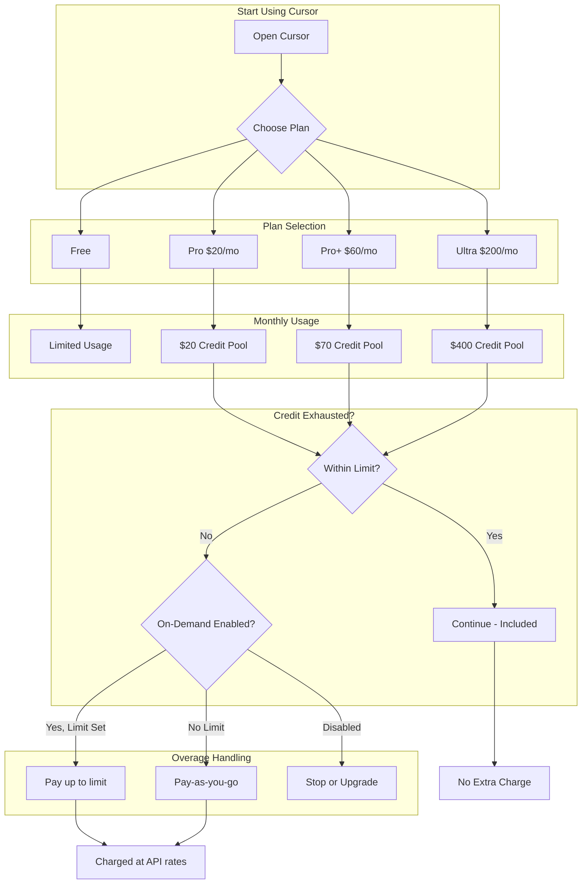
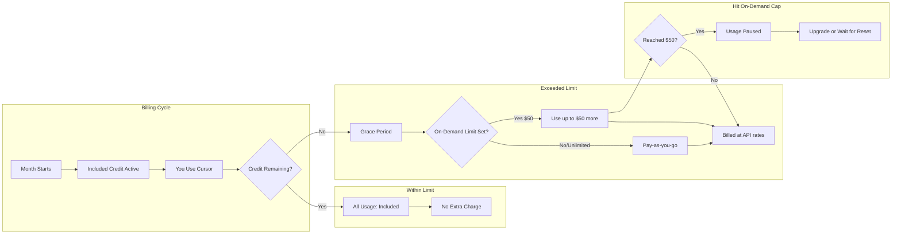
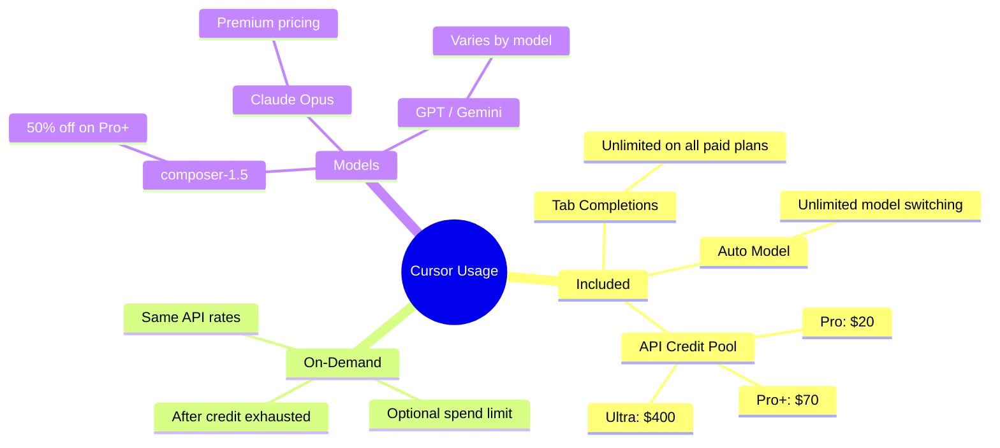
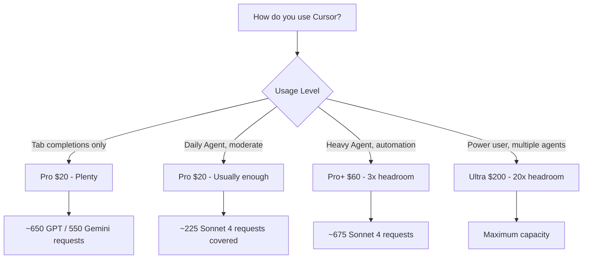
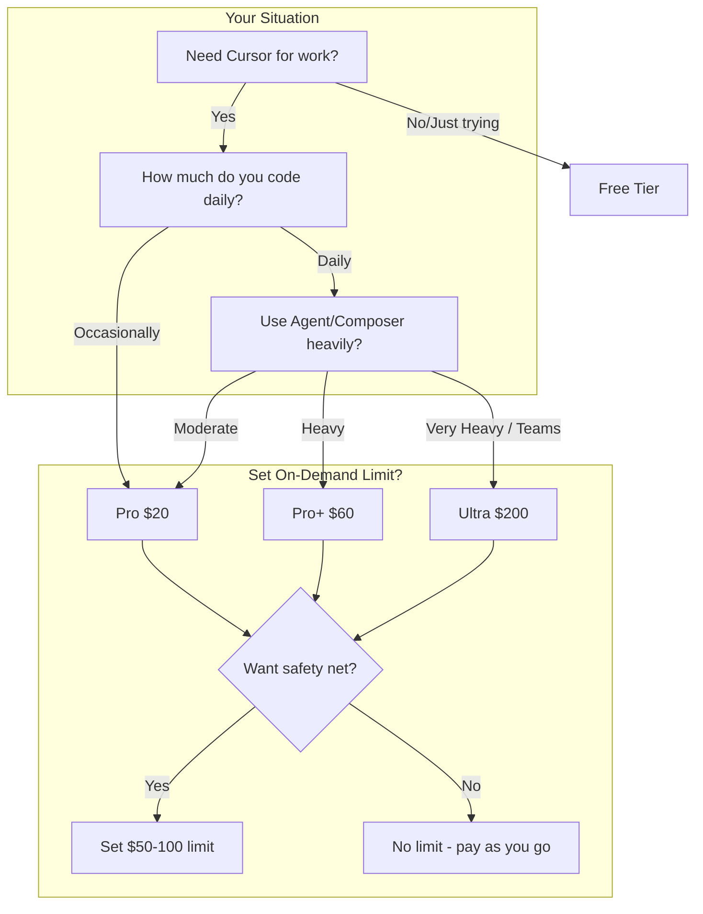

# Cursor Pricing Guide

A comprehensive guide to Cursor's pricing, plans, and billing.

## Table of Contents

- [Plan Comparison Table](#plan-comparison-table)
- [Checking Your Usage & Remaining Limit](#checking-your-usage--remaining-limit)
- [Understanding On-Demand Usage](#understanding-on-demand-usage)
- [Billing Alerts](#billing-alerts)
- [Dashboard Navigation](#dashboard-navigation)
- [Avoiding Extra Charges](#avoiding-extra-charges)
- [Tips to Reduce Usage](#tips-to-reduce-usage)
- [Model Pricing & Usage](#model-pricing--usage)
- [Teams & Enterprise Plans](#teams--enterprise-plans)
- [Cloud Agents & Bugbot](#cloud-agents--bugbot)
- [Billing Cycle & Reset](#billing-cycle--reset)
- [FAQ](#faq)
- [Support & Resources](#support--resources)
- [Troubleshooting](#troubleshooting)
- [Tokens Explained](#tokens-explained)
- [Key Terms Glossary](#key-terms-glossary)
- [About This Guide](#about-this-guide)

---

## Plan Comparison Table

| Feature | Free | Pro ($20/mo) | Pro+ ($60/mo) | Ultra ($200/mo) |
|---------|------|--------------|---------------|------------------|
| **Included API Usage** | Limited | $20/month | $70/month | $400/month |
| **Usage Multiplier** | — | 1x | 3x | 20x |
| **Tab Completions** | Limited | Unlimited | Unlimited | Unlimited |
| **Auto Model** | Limited | Unlimited | Unlimited | Unlimited |
| **Cloud Agents** | ❌ | ✅ | ✅ | ✅ |
| **Bugbot** | ❌ | ✅ | ✅ | ✅ |
| **Agent Limits** | Basic | Extended | Higher | Maximum |
| **Long-Running Agents** | ❌ | ❌ | ❌ | ✅ |
| **Early Access Features** | ❌ | ❌ | ❌ | ✅ |
| **On-Demand Usage** | ❌ | Optional | Optional | Optional |

---

## Pricing Flow Diagram

---

## User Billing Flow

---

## Usage Types Explained

---

## Plan Selection Guide

---

## Cost Breakdown by Usage Level

| User Type | Typical Monthly Usage | Recommended Plan | Est. Cost |
|-----------|------------------------|------------------|-----------|
| **Tab-only user** | Minimal | Pro | $20 |
| **Light Agent user** | $20–40 | Pro | $20 |
| **Daily Agent user** | $60–100 | Pro+ | $60 |
| **Power user** | $200+ | Ultra | $200 |
| **Heavy + Overage** | Variable | Pro+ + On-Demand | $60 + usage |

---

## Checking Your Usage & Remaining Limit

### Where to Check

1. Go to **[cursor.com/dashboard](https://cursor.com/dashboard)**
2. Open the **Usage** tab (or visit [cursor.com/dashboard?tab=usage](https://cursor.com/dashboard?tab=usage))
3. You'll see:
   - Token usage and cost per request
   - Date range filters (1d, 7d, 30d)
   - Whether each request is **Included** or **Charged**

### What You'll See

| Display | Meaning |
|--------|---------|
| **Included** | Usage covered by your plan—no extra charge |
| **Charged** | On-demand usage—billed at API rates |
| **$0 / $50** | On-demand: $0 used this month, $50 limit set |

### Understanding Your Bill

| Item | Amount | When You Pay |
|------|--------|--------------|
| **Subscription** | $60/mo (Pro+) | Every month |
| **Included usage** | $70 of API usage | Already in the $60—no extra charge |
| **On-demand** | Up to your limit (e.g. $50) | Only if you exceed the $70 |

**Example:** Use $90 of API → You pay $60 + $20 = **$80** total (not $70 + $50).

### Bonus Included Usage

Cursor may grant **additional included capacity** beyond the guaranteed amount ($20 / $70 / $400). So your dashboard can show total "Included" usage higher than the stated guarantee—still at no extra charge. If everything shows **Included**, you're not being charged overage.

### Example Usage Breakdown (Pro+)

A real cycle might look like this on the dashboard:

| Item | Tokens | Cost | Status |
|------|--------|------|--------|
| claude-4.6-opus-high | 64.5M | $52.76 | Included |
| composer-1 | 122.5M | $37.52 | Included |
| claude-4.6-opus-high-thinking | 22.1M | $20.85 | Included |
| composer-1.5 | 114.9M | $16.36 | Included |
| **Total** | **324M** | **$127.49** | **Included** |
| **On-Demand** | — | $0 / $5 limit | — |

Interpretation: All usage is included (possibly with bonus capacity). On-demand shows $0 used with a $5 cap. No extra charges.

---

## Understanding On-Demand Usage

### What It Means

**On-demand usage** = Extra usage you pay for **after** your included credit ($70 for Pro+) is used up.

### How the On-Demand Limit Works

| Limit Setting | When You Exceed $70 |
|---------------|---------------------|
| **$50 limit** | You can be charged up to $50 extra |
| **$0 limit** | Usage stops—no extra charge |
| **No limit** | Pay-as-you-go at API rates |

### Why Set a Limit?

- Prevents surprise bills
- You can change it anytime via **Edit Limit** in the dashboard
- Without a limit, you keep using Cursor and get charged for overage

---

## Billing Alerts

### Email Spend Alerts

Get email notifications when on-demand spend reaches thresholds you set.

| Setting | What It Does |
|---------|--------------|
| **Threshold** | Alert when on-demand spend reaches $X (e.g. $10, $25, $50) |
| **Type** | Per-user or team-level |
| **Behavior** | Sends email only—does **not** stop usage |

> **Note:** Alerts are based on **on-demand spend only**. Included usage ($70) does not count toward these thresholds.

### In-Editor Notifications

When you exceed your **included** usage, Cursor shows a notification in the editor. You can then:

- Upgrade your plan
- Enable on-demand usage
- Wait for the next billing cycle

### Alert Types Summary

| Alert Type | Where | When It Triggers |
|------------|--------|------------------|
| **Email spend alert** | Dashboard → Spending | On-demand spend reaches your threshold |
| **In-editor notification** | Cursor app | Included usage ($70) exceeded |
| **Usage view** | Dashboard → Usage | Always visible for manual checks |

### Recommended Setup

1. Set **spend alerts** at $10 and $25 to get warned before hitting your limit
2. Check the **Usage** tab regularly
3. Set **on-demand limit to $0** if you don't want any extra charges

---

## Dashboard Navigation

### Direct Links

| Tab | URL |
|-----|-----|
| **Usage** | [cursor.com/dashboard?tab=usage](https://cursor.com/dashboard?tab=usage) |
| **Spending** | [cursor.com/dashboard?tab=spending](https://cursor.com/dashboard?tab=spending) |
| **Billing** | [cursor.com/dashboard?tab=billing](https://cursor.com/dashboard?tab=billing) |
| **Settings** | [cursor.com/dashboard?tab=settings](https://cursor.com/dashboard?tab=settings) |

### Where to Find Things

| What You Need | Location |
|---------------|----------|
| **Edit Limit** (on-demand cap) | Usage tab or Billing tab |
| **Spend alerts** | Spending tab |
| **Usage history** | Usage tab → Export CSV |
| **Subscription** | Billing & Invoices |

### Can't Find Spending Tab?

- Try the direct link: [cursor.com/dashboard?tab=spending](https://cursor.com/dashboard?tab=spending)
- On individual plans, spending controls may be under **Billing & Invoices** or **Usage**
- Look for **"$0 / $50 On-Demand Usage"** with **Edit Limit** button

---

## Avoiding Extra Charges

### Option 1: Set On-Demand Limit to $0

1. Go to [cursor.com/dashboard](https://cursor.com/dashboard)
2. Open **Usage** or **Spending** tab
3. Find **"On-Demand Usage"** with **Edit Limit**
4. Set limit to **$0**

When you exceed $70, Cursor stops instead of charging you.

### Option 2: Disable Usage-Based Pricing

1. Go to [cursor.com/dashboard](https://cursor.com/dashboard)
2. Open **Settings**
3. Find **Usage-based pricing** or **On-demand usage**
4. Turn it **off**

### Option 3: Use Spend Alerts

Set alerts at $10 and $25 so you're warned before hitting your limit and can reduce usage.

---

## Tips to Reduce Usage

Stay within your included credit with these practices:

| Tip | Why It Helps |
|-----|--------------|
| **Use Auto model** | Unlimited on paid plans—doesn't draw from your credit pool |
| **Prefer Tab completions** | Unlimited; use for quick suggestions instead of Agent |
| **Avoid Max Mode** | Uses more tokens per request; only enable for complex tasks |
| **Keep context focused** | Fewer files/context = fewer input tokens |
| **Choose composer-1.5** | 50% off on Pro+; more efficient than premium models |
| **Avoid large codebase scans** | Indexing and large context consume more tokens |

---

## Model Pricing & Usage

### What Draws From Your Pool vs. Unlimited

| Model / Feature | Usage | Notes |
|-----------------|-------|-------|
| **Auto** | Unlimited | Cursor picks the best model—recommended to stay within limits |
| **Tab completions** | Unlimited | Always included on paid plans |
| **composer-1.5** | From pool | 50% discount on Pro+ |
| **Claude / GPT / Gemini** | From pool | Premium pricing; varies by model |
| **Max Mode** | From pool | Higher usage—longer reasoning, up to 1M context |

### Rough Cost per Request (Median)

| Model | Approx. Requests Covered by $20 (Pro) |
|-------|--------------------------------------|
| Sonnet 4 | ~225 |
| Gemini | ~550 |
| GPT 4.1 | ~650 |

---

## Teams & Enterprise Plans

### Teams ($40/user/mo)

| Feature | Details |
|---------|---------|
| **Pricing** | $40 per user per month |
| **Usage** | Pooled usage across team |
| **Features** | SAML/OIDC SSO, Admin Dashboard, usage stats |
| **Best for** | Teams that want centralized billing and controls |

### Enterprise (Custom)

| Feature | Details |
|---------|---------|
| **Pricing** | Custom |
| **Features** | Everything in Teams + priority support, pooled usage, invoicing, SCIM, advanced security |
| **Best for** | Large orgs needing compliance, invoicing, or advanced controls |

---

## Cloud Agents & Bugbot

### Cloud Agents

- **Pricing:** Charged at API pricing for the selected model
- **Usage:** Draws from your plan's credit pool (Pro/Pro+/Ultra)
- **Spend limit:** You set a spend limit when first using Cloud Agents
- **Note:** VM compute for cloud agents may be priced separately in the future

### Bugbot (Separate Product)

| Plan | Price | Includes |
|------|-------|----------|
| **Pro** | $40/mo | Unlimited reviews on up to 200 PRs/month |
| **Teams** | $40/user/mo | Unlimited reviews, analytics, advanced rules |
| **Enterprise** | Custom | Everything + advanced analytics, priority support |

Bugbot has its own subscription—separate from your Cursor Pro/Pro+/Ultra plan.

---

## Billing Cycle & Reset

| Event | What Happens |
|-------|--------------|
| **Month start** | Included credit ($20/$70/$400) resets |
| **Exhaust credit** | Short grace period, then on-demand kicks in (if enabled) |
| **Hit on-demand limit** | AI features stop until next billing cycle |
| **Next cycle** | Usage resets; you can use Cursor again |

Usage resets on your billing date (e.g., if you subscribed on the 17th, it resets monthly on the 17th).

---

## FAQ

### Will I be charged if everything shows "Included"?

**No.** "Included" means usage is covered by your plan. You only pay extra when requests show "Charged" (on-demand).

### What if I can't find the Spending tab?

Try [cursor.com/dashboard?tab=spending](https://cursor.com/dashboard?tab=spending) directly. On individual plans, controls may be under **Usage** or **Billing & Invoices**. Look for "On-Demand Usage" with **Edit Limit**.

### Can I get a refund for unexpected charges?

Contact **pro-pricing@cursor.com**. Cursor has offered refunds for unexpected usage in the past. Include your account details and the billing period.

### What's the difference between Usage and Spending tabs?

| Tab | Purpose |
|-----|---------|
| **Usage** | View token usage, cost per request, export CSV, Edit Limit |
| **Spending** | Set spend limits, configure spend alerts |

### Is my $70 included in the $60 I pay?

**Yes.** The $70 is part of your $60 Pro+ subscription. You don't pay $60 + $70. You only pay extra if you exceed the $70 and have on-demand enabled.

---

## Support & Resources

| Need | Contact / Link |
|------|----------------|
| **Pricing questions / refunds** | [pro-pricing@cursor.com](mailto:pro-pricing@cursor.com) |
| **General support** | [hi@cursor.com](mailto:hi@cursor.com) |
| **Official pricing** | [cursor.com/pricing](https://cursor.com/pricing) |
| **Docs** | [cursor.com/docs/account/pricing](https://cursor.com/docs/account/pricing) |
| **Usage dashboard** | [cursor.com/dashboard?tab=usage](https://cursor.com/dashboard?tab=usage) |

---

## Troubleshooting

| Issue | Solution |
|-------|----------|
| **Spending limit resets to $50** | Known issue. Re-set your limit in the dashboard after toggling usage-based pricing. |
| **Edit Limit UI opens and closes** | Try the **Settings** tab instead of the main dashboard. |
| **Usage tab shows different data** | Usage = token/cost breakdown. Spending = limits and alerts. Both are valid. |
| **Can't set limit to $0** | Try the lowest allowed value, or contact pro-pricing@cursor.com to disable on-demand. |

---

## Tokens Explained

### What Are Tokens?

Tokens are the units AI models use—roughly words or word parts. Pricing is per token, not per request.

### Token Types

| Type | What It Is | Relative Cost |
|------|------------|---------------|
| **Input tokens** | Your prompt, context, conversation history | Lower |
| **Output tokens** | What the model generates | 2–4× higher |

### Why It Matters

- Larger context = more input tokens = higher cost
- Longer responses = more output tokens = higher cost
- Use the **Usage** tab to see token counts per request

---

## Key Terms Glossary

| Term | Definition |
|------|------------|
| **Included Usage** | API usage covered by your monthly plan—no extra charge |
| **Credit Pool** | Dollar amount of API usage included each month (e.g., $20, $70, $400) |
| **On-Demand Usage** | Usage billed after your included credit is exhausted |
| **On-Demand Limit** | Cap you set for extra spending (e.g., $50 max overage) |
| **Auto Model** | Cursor selects the best model automatically—unlimited on paid plans |
| **API Pricing** | Usage charged at the same rates as the underlying model providers |
| **Grace Period** | Short buffer after exhausting credit before overage billing starts |
| **3x / 20x** | Pro+ = 3× Pro's usage; Ultra = 20× Pro's usage |

---

## Mermaid: Complete Pricing Decision Tree

---

## Quick Reference: What Gets Charged?

| Action | Free | Pro | Pro+ | Ultra |
|--------|------|-----|------|-------|
| Tab completions | Limited | ✅ Included | ✅ Included | ✅ Included |
| Auto model | Limited | ✅ Included | ✅ Included | ✅ Included |
| Composer (Agent) | Limited | From $20 pool | From $70 pool | From $400 pool |
| Claude/GPT/Gemini | Limited | From pool | From pool | From pool |
| Exceed pool | N/A | On-demand or pause | On-demand or pause | On-demand or pause |
| Cloud Agents | ❌ | From pool | From pool | From pool |

---

## About This Guide

- **Last updated:** February 2026
- **Disclaimer:** Cursor's pricing, UI, and features change over time. Always verify current details at [cursor.com/pricing](https://cursor.com/pricing) and [cursor.com/docs/account/pricing](https://cursor.com/docs/account/pricing).
